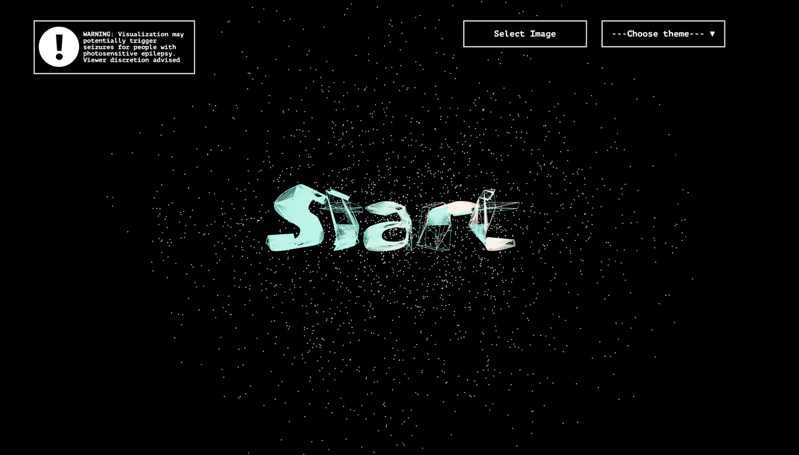
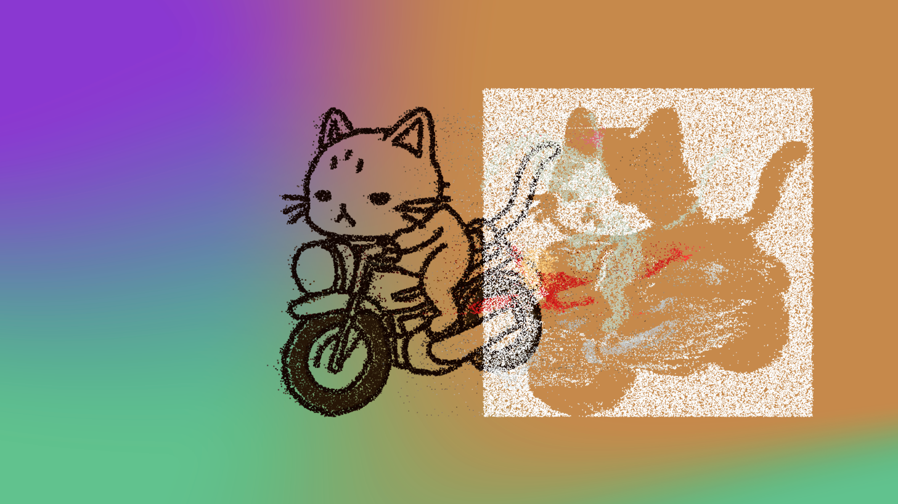
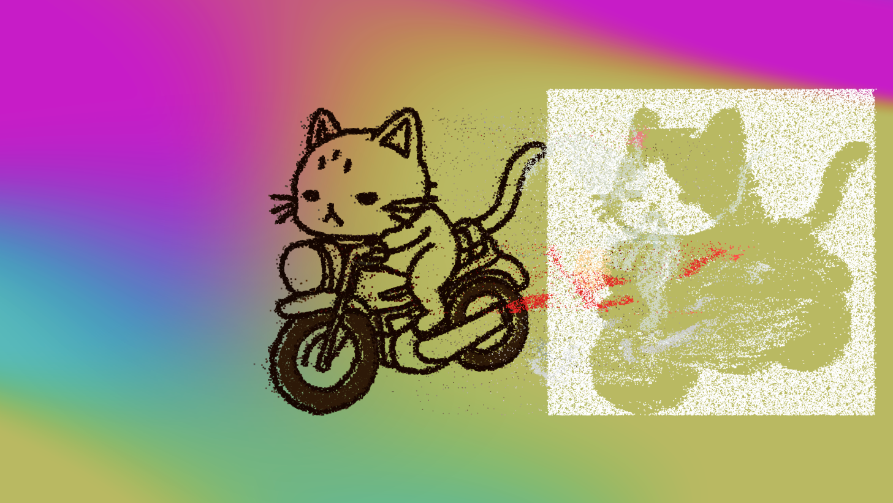
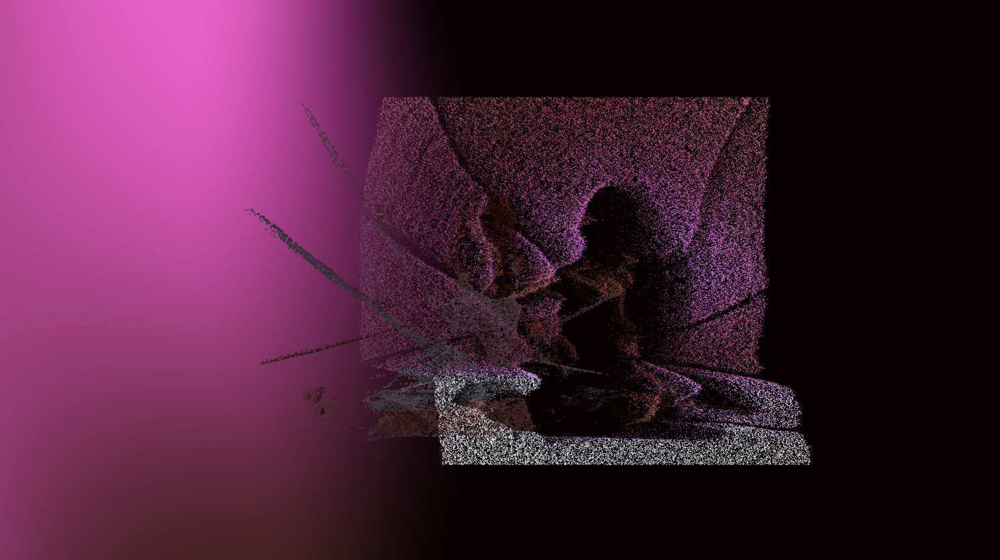
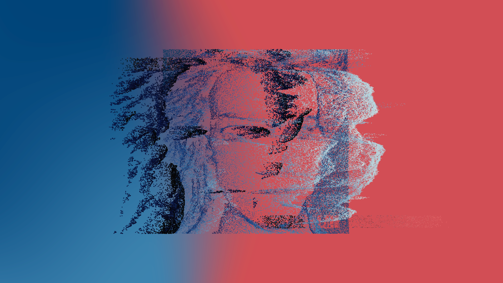

## PixieDust Audio Visualizer

Open [https://pixiedust.vercel.app/](https://pixiedust.vercel.app/) to view the app!

## Features
<ul>
  <li>Enable the microphone on your browser and press start to begin visualizing audio. </li>
  <li>If you don't select an image or theme you will see the default cat image and image theme. </li>
  <li>You can upload your own image and choose a theme to customize the visual.  </li>
  <li>The mood theme will change the background colors based on the audio frequencies. </li>
  <li>The image theme will change the background colors based on the color palette of the image. </li>
  <li>Start speaking or play your favorite song/playlist to see the visual in action. </li>
</ul>

## Mood Theme Examples:

## Image Theme Examples:

